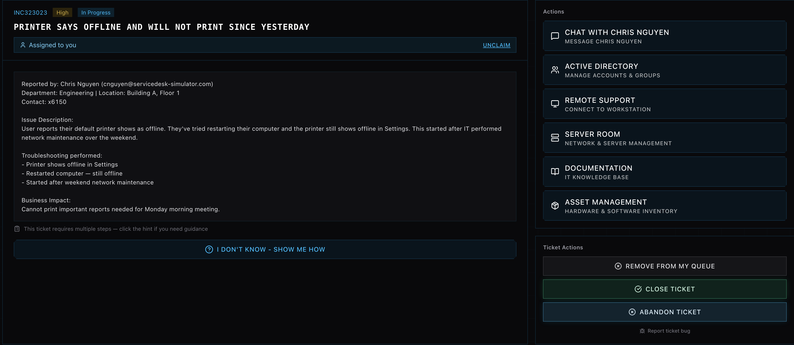
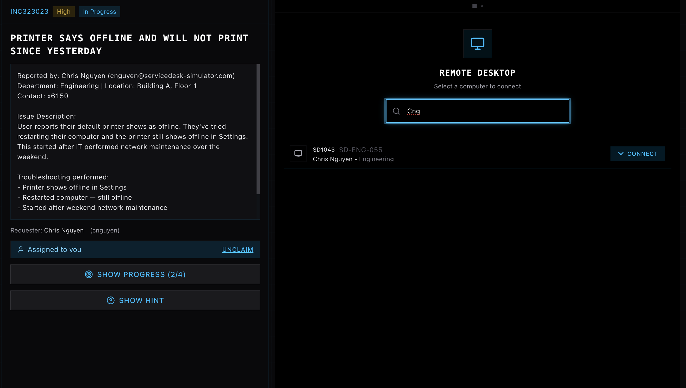
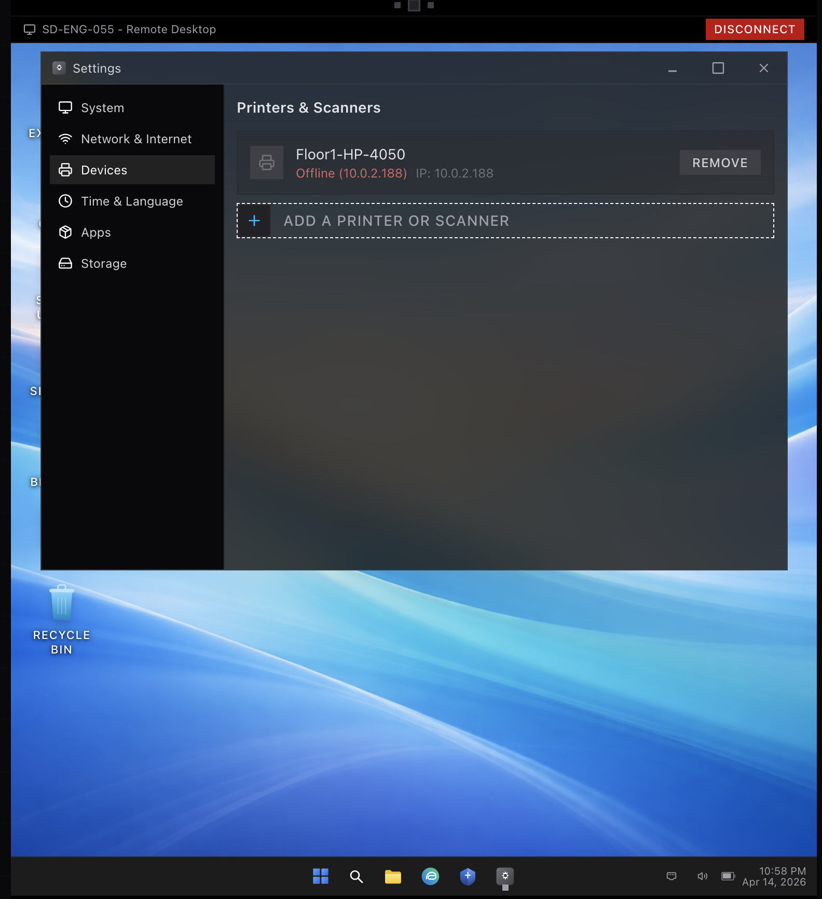
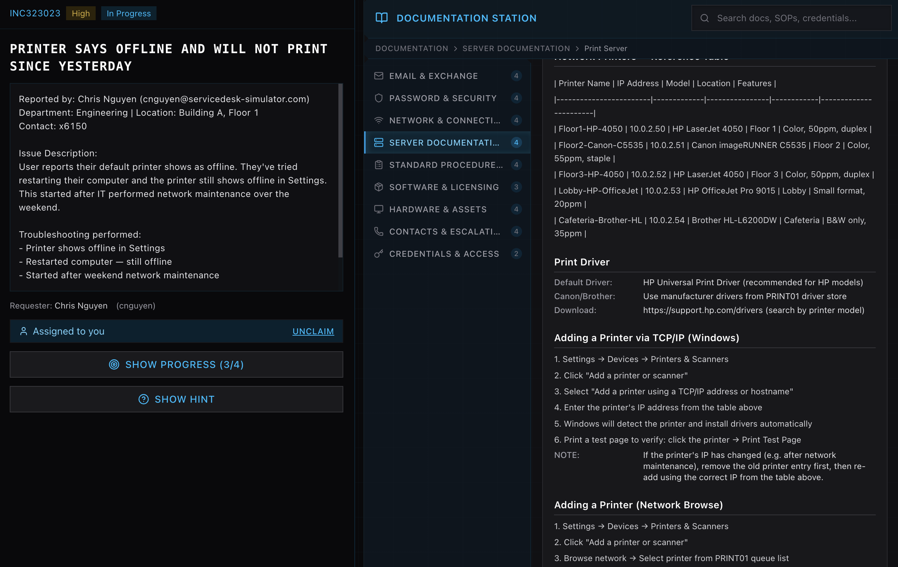
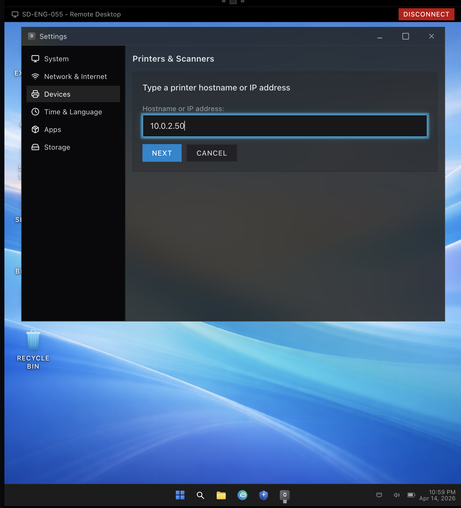
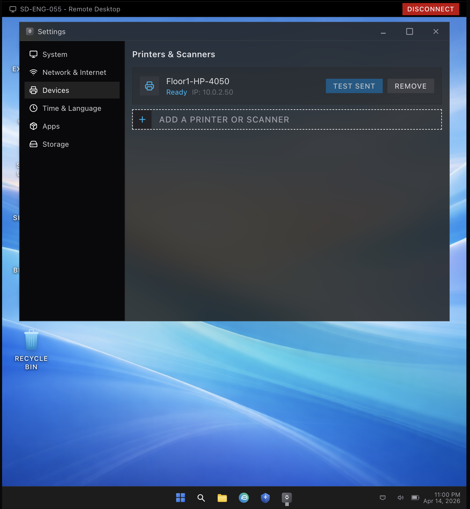
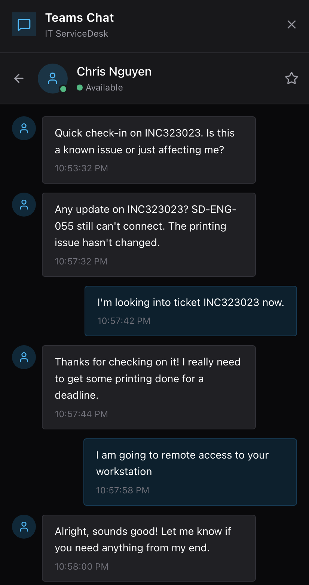
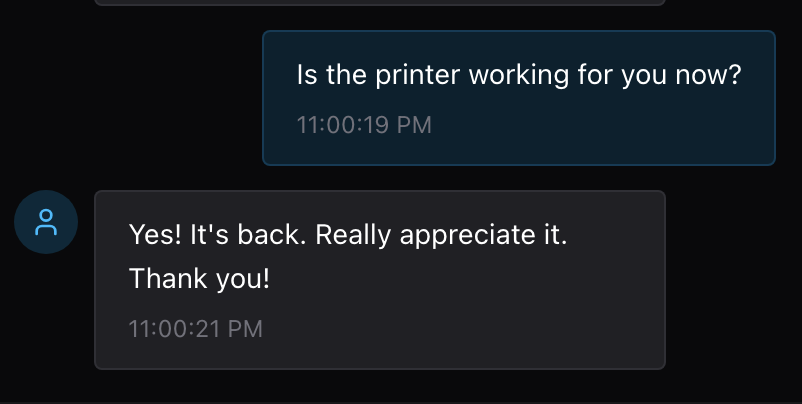

# Printer Offline – Reconfiguration via TCP/IP

**Category:** Printer / Network  
**Priority:** High  
**Status:** Resolved  

## Issue Description
User reported that their default printer appeared offline and was unable to print. Issue began after recent network maintenance. Restarting the workstation did not resolve the problem.

## Environment
- OS: Windows 10  
- Access Method: Remote Desktop  
- Tools Used: Windows Settings, Internal Documentation, Remote Support  

## Troubleshooting Steps
1. Acknowledged the user’s request and maintained communication throughout the troubleshooting process.  
2. Remotely accessed the user’s workstation.  
3. Navigated to printer settings and confirmed the configured printer was showing as offline.  
4. Identified the printer was associated with an outdated IP address.  
5. Removed the unresponsive printer from the system.  
6. Reviewed internal documentation to locate the correct printer IP address following recent network changes.  
7. Re-added the printer using the correct TCP/IP address.  
8. Printed a test page to validate functionality.  

## Resolution Summary
Accessed the user’s system remotely and identified that the configured printer was pointing to an outdated IP address following network maintenance. Removed the existing printer and reconfigured it using the correct IP address obtained from internal documentation. Verified successful operation with a test print and confirmed resolution with the user.

## Key Actions & Outcome
- Diagnosed printer connectivity issue caused by outdated IP configuration  
- Maintained consistent communication with the user during troubleshooting  
- Referenced internal documentation to identify correct network configuration  
- Reconfigured printer using TCP/IP settings  
- Successfully restored printing functionality and confirmed with user  

## Screenshots
  
  
  
  
  
  
  

