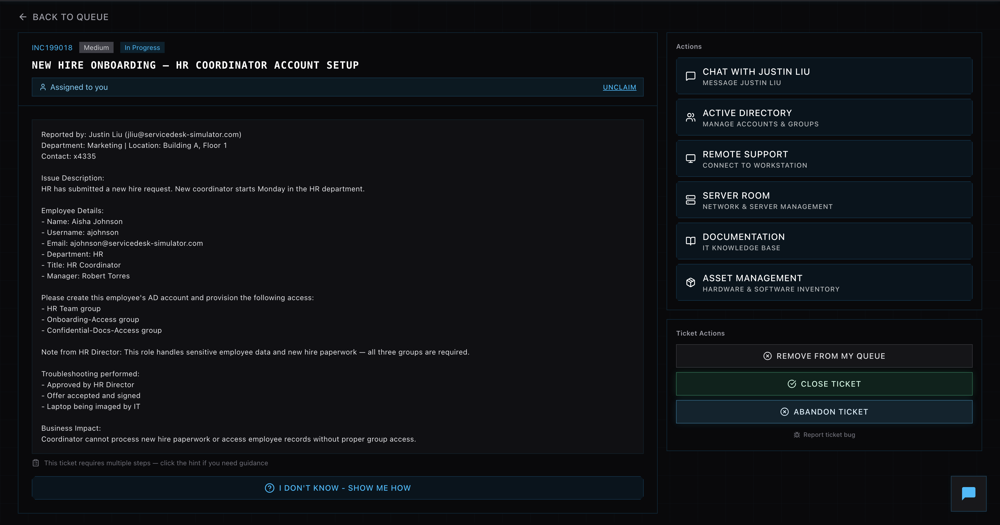
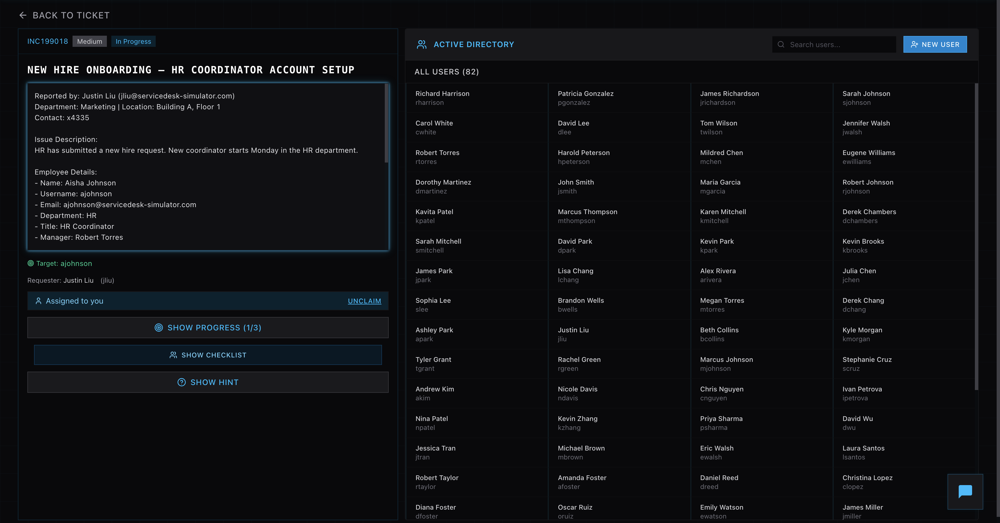
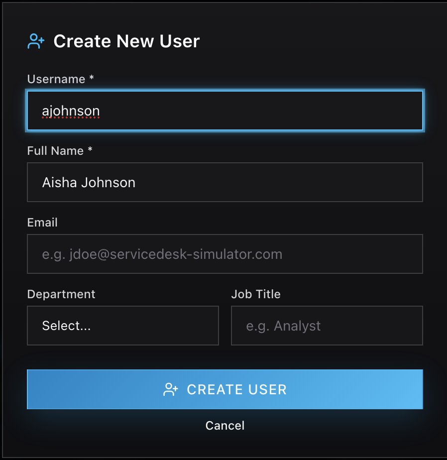
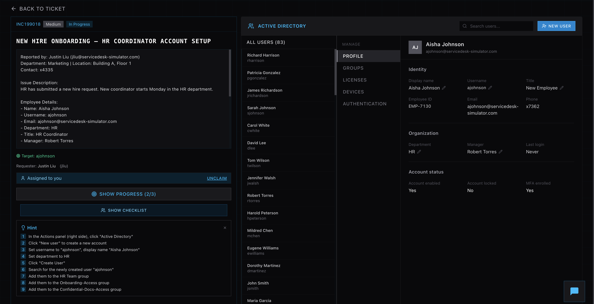
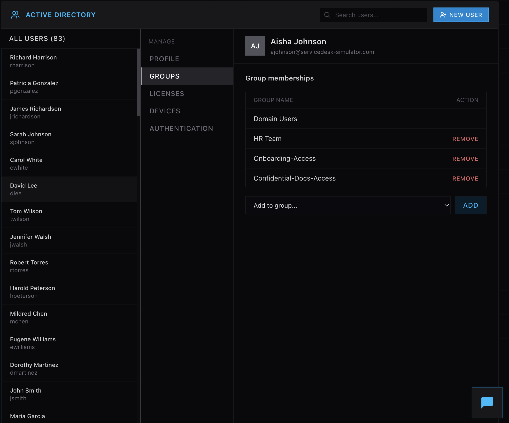

# New Hire Onboarding – Active Directory Account Provisioning

## Overview  
Simulated a real-world IT help desk ticket involving onboarding a new HR employee. The task required creating an Active Directory account and provisioning appropriate access based on role-specific requirements.

## Actions Performed  

- Reviewed ticket details to gather employee information and required access permissions  
- Accessed Active Directory management console to begin user provisioning  
- Created a new user account with the following attributes:  
  - Username: `ajohnson`  
  - Full Name: Aisha Johnson  
  - Department: HR  
  - Job Title: HR Coordinator  
  - Email: ajohnson@servicedesk-simulator.com  

- Verified successful account creation and ensured account was enabled  
- Located the newly created user within the directory  

## Access Provisioning  

Assigned the user to the required security groups:

- HR Team  
- Onboarding-Access  
- Confidential-Docs-Access  

Verified group membership to ensure proper authorization levels.

## Validation  

- Confirmed user account appears in Active Directory  
- Verified all required group memberships were successfully assigned  
- Ensured account status was active and ready for use  

## Business Impact  

Proper onboarding ensures the employee has immediate access to critical systems, enabling them to process sensitive HR data without delay.

## Skills Demonstrated  

- Active Directory user management  
- Role-Based Access Control (RBAC)  
- Identity and Access Management (IAM)  
- IT ticket handling  

## Screenshots

### Ticket Overview

### Active Directory Dashboard

### User Creation

### User Profile

### Group Memberships

