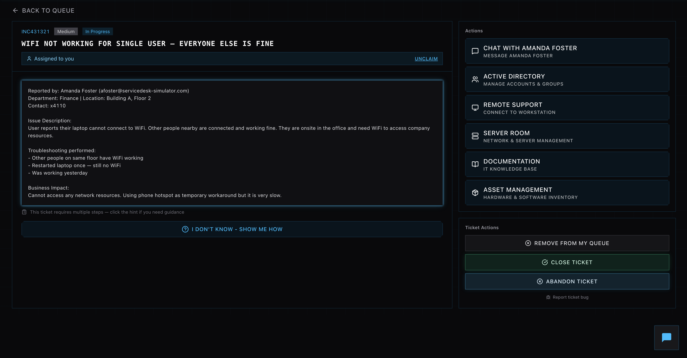
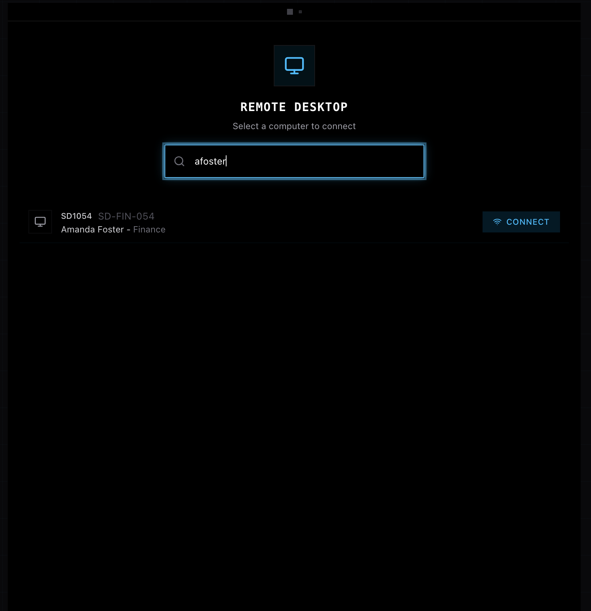
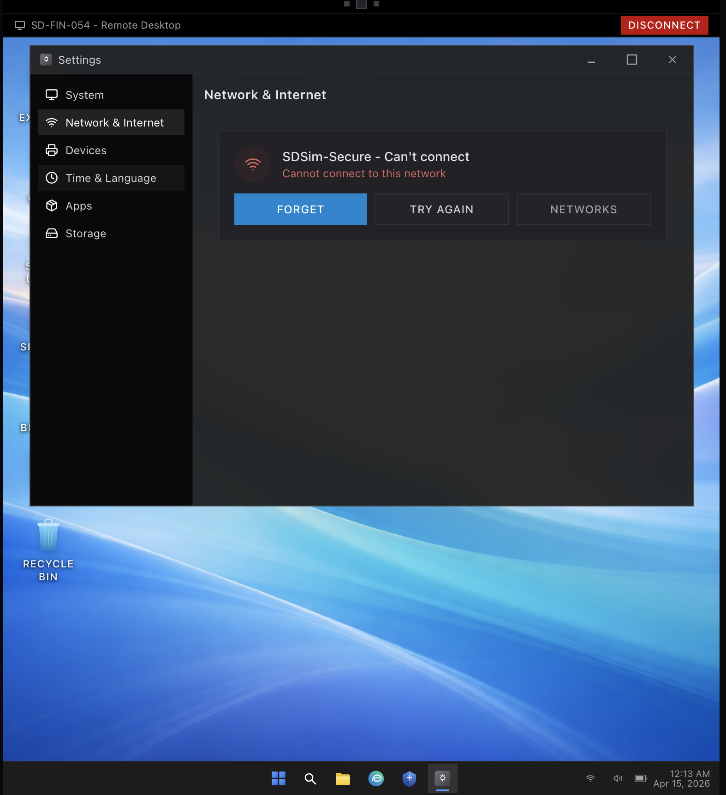
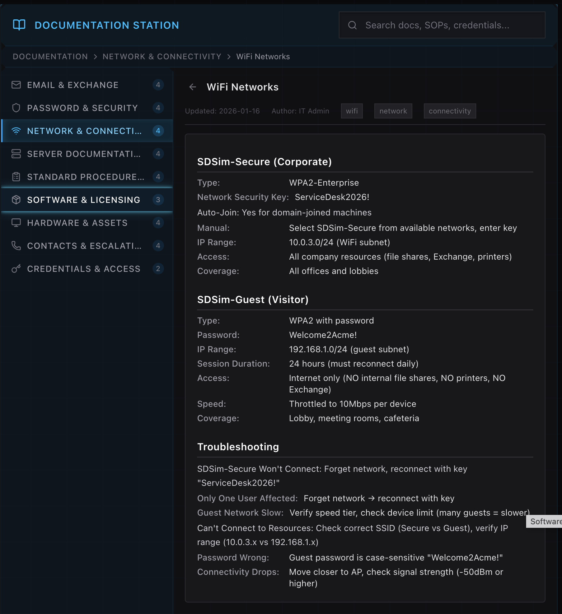
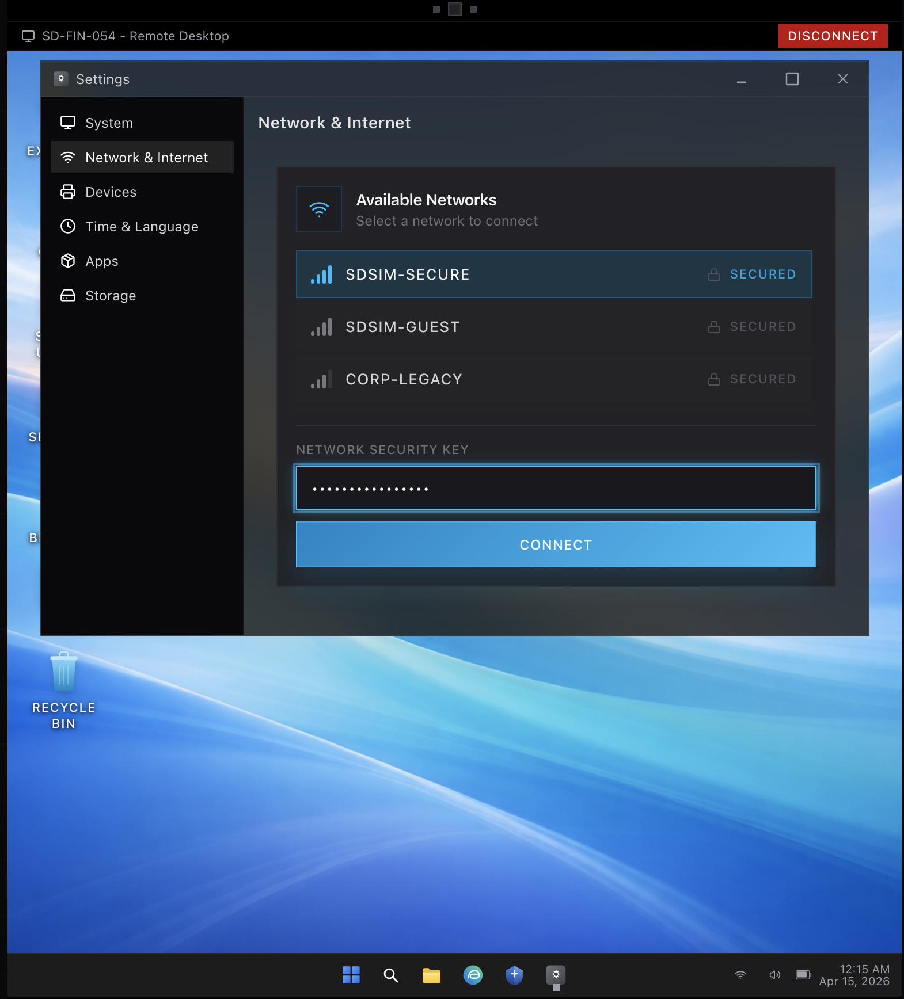
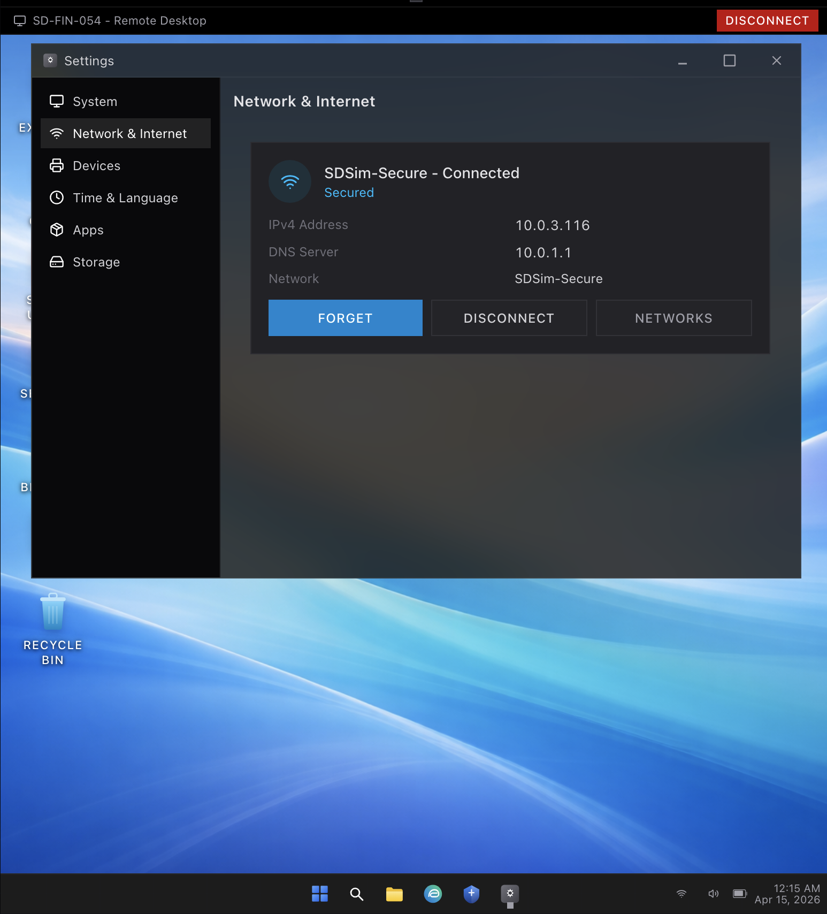
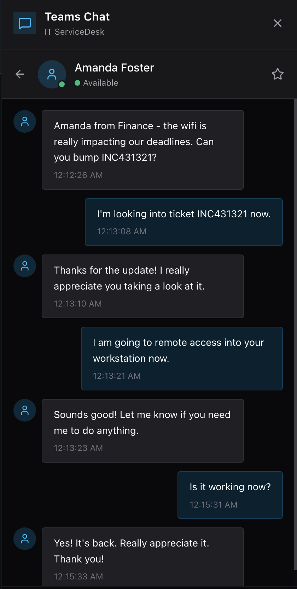

# WiFi Connectivity Issue – Single User Troubleshooting

## Overview
Resolved a WiFi connectivity issue affecting a single user while all other users on the same network remained unaffected. The issue required isolating the problem to the user’s device rather than the network infrastructure.

## Actions Taken
- Reviewed the ticket and confirmed that only one user was experiencing connectivity issues
- Communicated with the user via chat to acknowledge the issue and provide updates
- Initiated a remote desktop session to the affected workstation
- Observed that the device was unable to connect to the corporate WiFi network (SDSim-Secure)
- Accessed internal documentation to verify correct network configuration and troubleshooting steps

## Troubleshooting Process
- Identified that the issue was likely caused by a misconfigured or cached network profile
- Followed documentation guidance to forget the existing WiFi network
- Reconnected the device to the correct corporate network (SDSim-Secure)
- Re-entered the network security key as specified in documentation

## Resolution
- Successfully reconnected the device to the WiFi network
- Verified connectivity by confirming a valid IP address assignment
- Ensured access to network resources was restored
- Confirmed with the user that the issue was fully resolved

## Business Impact
Resolved the issue quickly to restore the user’s ability to access company resources, preventing further disruption to work and maintaining productivity.

## Skills Demonstrated
- Network troubleshooting  
- Remote desktop support  
- Documentation utilization  
- End-user communication  
- Problem isolation (device vs network)  

---

## Screenshots

### 1. Ticket Overview

### 2. Remote Desktop Connection

### 3. WiFi Error – Cannot Connect

### 4. Documentation Reference

### 5. Reconnecting to Secure Network

### 6. WiFi Connected Successfully

### 7. User Confirmation Chat

