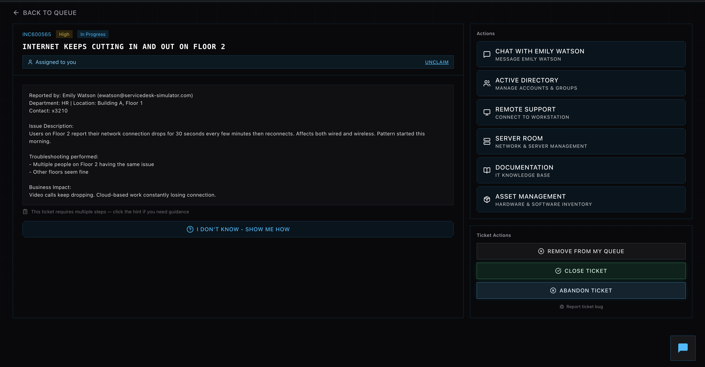
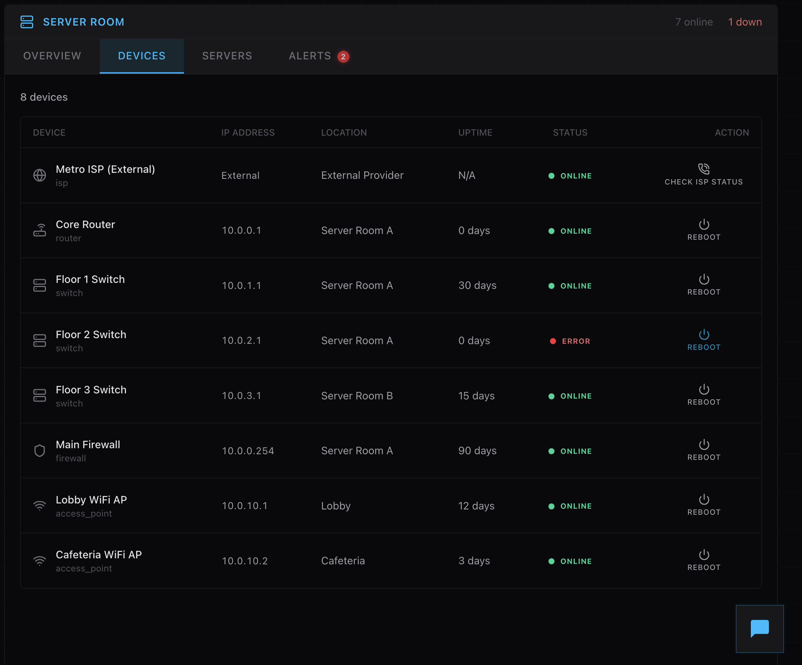

# Intermittent Network Connectivity – Floor 2

## Overview
Resolved an intermittent network connectivity issue affecting multiple users on Floor 2. The issue impacted both wired and wireless connections, indicating a potential network infrastructure problem rather than an individual device issue.

## Actions Taken
- Reviewed the ticket and confirmed that multiple users on Floor 2 were experiencing connectivity drops
- Identified that other floors were not affected, isolating the issue to a specific network segment
- Accessed the server room network management interface to investigate infrastructure status

## Troubleshooting Process
- Reviewed network devices and identified that the Floor 2 switch was in an error state
- Determined that the switch was likely causing intermittent connectivity for all connected users
- Initiated a reboot of the affected Floor 2 switch to restore normal operation

## Resolution
- Successfully rebooted the Floor 2 switch
- Verified that the switch returned to an online status
- Confirmed that network connectivity was stable for affected users
- Communicated with the user to confirm the issue was fully resolved

## Business Impact
Restored stable network connectivity for an entire floor, preventing disruptions to meetings, cloud-based work, and overall productivity.

## Skills Demonstrated
- Network troubleshooting at the infrastructure level  
- Issue isolation (single user vs multi-user)  
- Network device management  
- Root cause analysis  
- End-user communication  

---

## Screenshots

### 1. Ticket Overview

### 2. Floor 2 Switch Error

### 3. Rebooting Floor 2 Switch

### 4. Switch Status Restored

### 5. User Confirmation Chat

