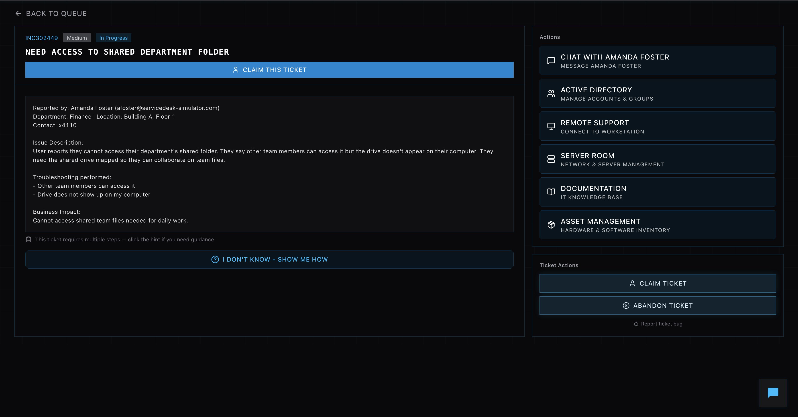
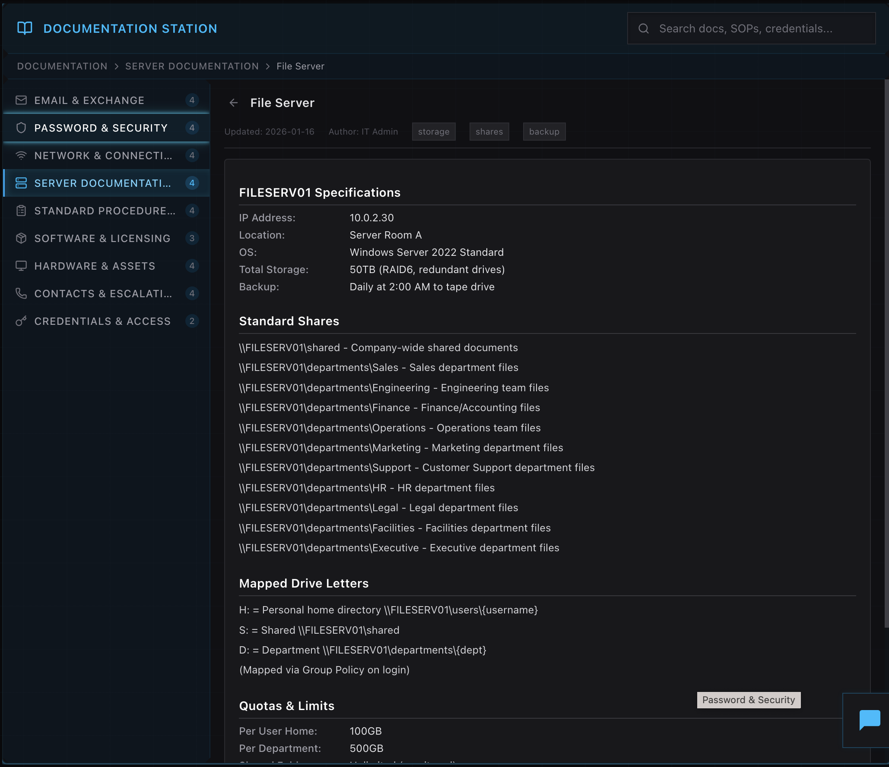
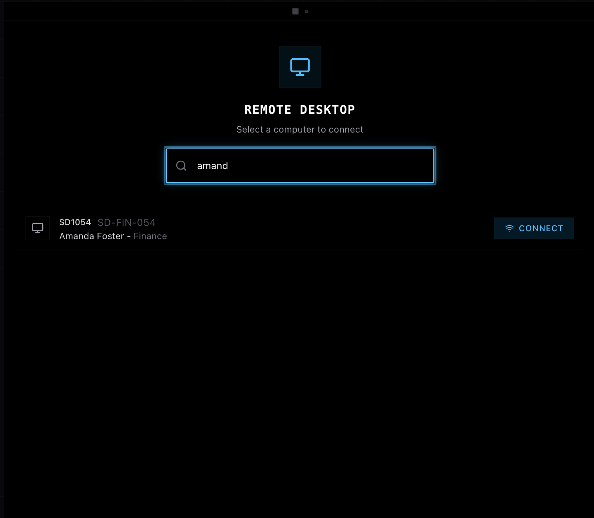
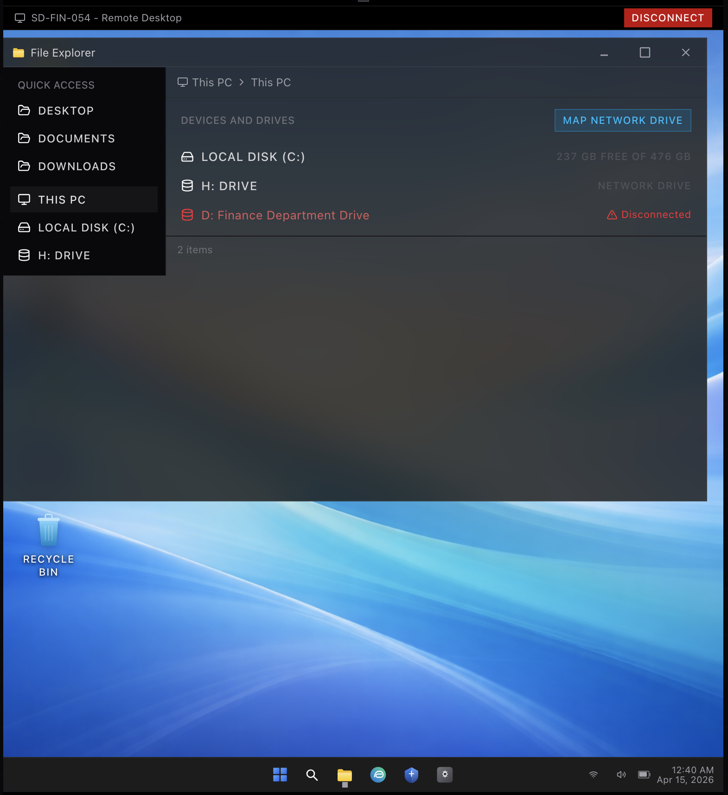
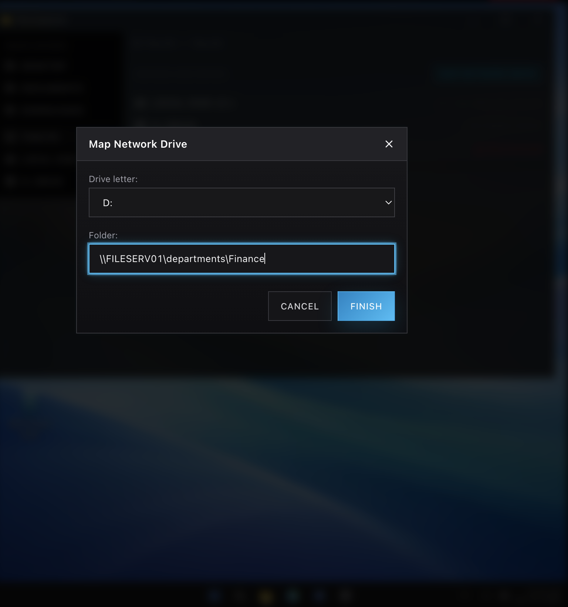
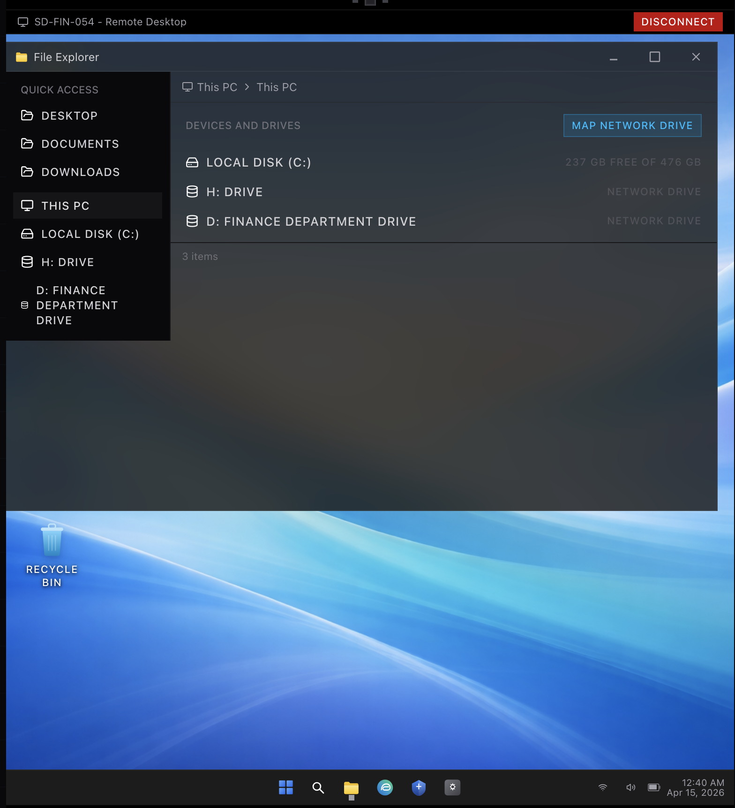
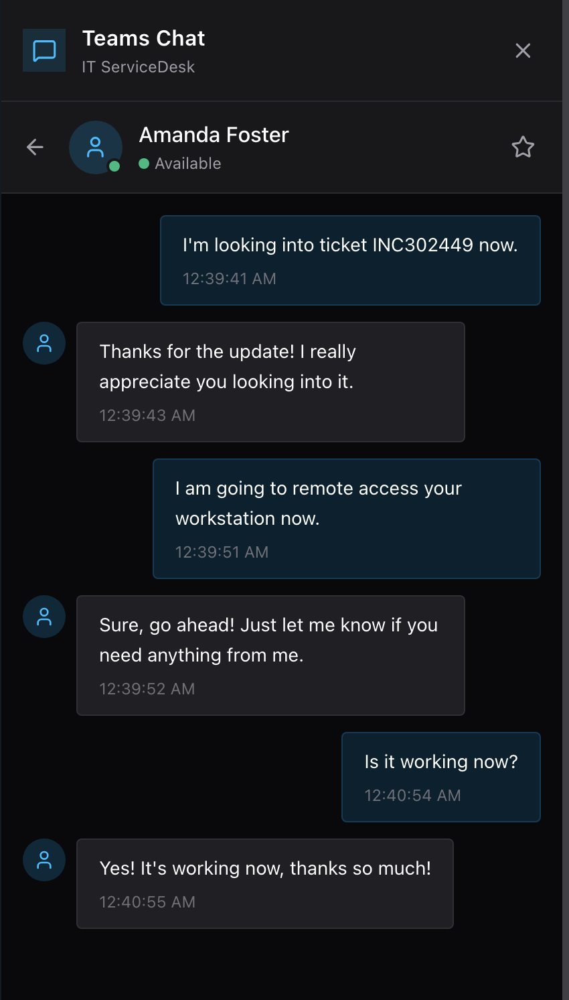

# Mapped Network Drive – Finance Department Access

## Overview
Resolved an issue where a user was unable to access their department's shared folder because the network drive was not mapped on their workstation.

## Actions Taken
- Reviewed the ticket and confirmed that other users had access to the shared folder
- Determined the issue was isolated to a missing mapped network drive on the user’s machine
- Accessed internal documentation to identify the correct file server path and drive mapping configuration

## Troubleshooting Process
- Verified file server details and department share paths in documentation
- Remotely connected to the user’s workstation
- Confirmed that the Finance department drive (D:) was not properly mapped
- Initiated the process to map the network drive using the correct file server path

## Resolution
- Successfully mapped the Finance department shared drive using the correct network path:
  \\FILESERV01\departments\Finance
- Verified that the drive appeared in File Explorer and was accessible
- Confirmed functionality by ensuring the user could access shared files
- Received confirmation from the user that the issue was resolved

## Business Impact
Restored access to critical department files, allowing the user to resume daily work and collaboration without disruption.

## Skills Demonstrated
- Active Directory & file share troubleshooting  
- Network drive mapping  
- Documentation usage (SOPs / internal KB)  
- Remote desktop support  
- End-user communication  

---

## Screenshots

### 1. Ticket Overview

### 2. File Server Documentation

### 3. Remote Desktop Connection

### 4. Missing Network Drive

### 5. Map Network Drive Configuration

### 6. Drive Successfully Mapped

### 7. User Confirmation Chat

